# C Project

## C Projects of Class 12 by Sabina Pakuwal

### WAP to print asterisk

> Code

```c
#include <stdio.h>
void main()
{
    int i, j;
    for (i = i; i <= 1; i++) // rows
    {
        for (j = 1; j <= i; j++) // column

        {
            printf("*");
        }
        printf("\n");
    }
    return 0;
}
```

> Output

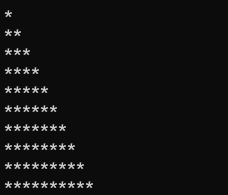

### WAP to store record of 2 books

> Code

```c
#include <stdio.h>
#include <conio.h>
struct book
{
    char name[50];
    float price;
    int pages;
};
void main()
{
    struct book b[100]; /*array of students */
    float temp;
    int i;
    for (i = 0; i < 2; i++)
        ;
    {
        printf("\n Enter name:");
        scanf("%s", b[i].name);
        printf("\n Enter price:");
        scanf("%f", &temp);
        b[i].price = temp;
        printf("\n Enter pages:");
    }
    for (i = 0; i < 2; i++)
    {
        printf("\nName:%s \t pice:%f \t  pages:%d", b[i].name, b[i].price, b[i].pages);
    }
    getch();
}
```

> Output

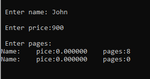

### WAP to find whether a person is eligible to vote or not

> Code

```c
#include <stdio.h>
#include <conio.h>
int main()
{
    int age;
    printf("Enter age\n");
    scanf("%d", &age);
    if (age >= 18)
    {
        printf("Eligible to vote");
    }
    else
    {
        printf("Not eligible to vote");
    }
    return 0;
}
```

> Output

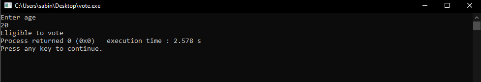

### WAP to record the employees name and salary in a data file and display them

> Code

```c
#include <stdio.h>
#include <conio.h>
void main()
{
    int sal;
    char name[25], ch;
    FILE *fp;
    fp = fopen("abc.txt", "w");
    do
    {
        prinf("Enter employee name,salary");
        scanf("%s%d", name, &sal);
        fprinf(fp, "%s%d", name, sal);
        prinf("Do you want to add more records");
        scnaf("%c", &ch);
    } while (ch == "y");
    fclose(fp);
}
fp = fopen("abc.txt", "r");
while (fscanf(fp, "%s%d", name, &sal) !EOF)
{
    printf("\n name=%s \t salary=%d", name, sal);
    fclsoe(fp);
    getch();
}
```

> Output

### WAP using while loop print upto 50

> Code

```c
#include <stdio.h>
#include <conio.h>
int main()
{
    int a;
    while (a <= 50)
    {
        printf("%d\n", a);
        a++;
    }
    getch();
}
```

> Output

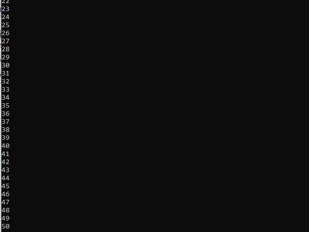

### WAP to print a fibonacci series

> Code

```c
#include <stdio.h>
#include <conio.h>
int main()
{
    int a = 0, b = 1, c, i, n;
    printf("Enter how many numbers");
    scanf("%d ", &n);
    printf("%d%d", a, b);
    for (i = 1; i <= n - 2; i++)
    {
        c = a + b;
        printf("%a", c);
        a = b;
        b = c;
    }
    return 0;
}
```

> Output

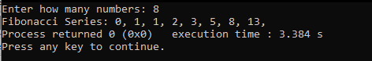

### WAP to write 'n' person name, address and tel no in a data file and display them reading successive data from the file in proper format

> Code

```c
#include <stdio.h>
#include <conio.h>
void main()
{
    char name[25];
    char address[25];
    char telno[25];
    FILE *fp;
    int i, n;
    fp = fopen("rec.data", "a");
    scanf("%d", &n);
    for (i = 0; i < n; i++)
    {
        printf("\n Enter the name");
        scanf("%s", name);
        printf("\n Enter the address");
        scanf("%s", address);
        printf("\n Enter the telno");
        scanf("%s", telno);
        fprintf(fp, "\n%s\t%s\t%s", name, address, telno);
    }
    fclose(fp);
    fp = fopen("rec.data", "r");
    printf("name\t address \t telno\n");
    while (fscanf(fp, "%s%s%s", name, address, telno) != EOF)
    {
        printf("\n%s \t%s \t%s", name, address, telno);
    }
    fclose(fp);
    getch();
}
```

> Output

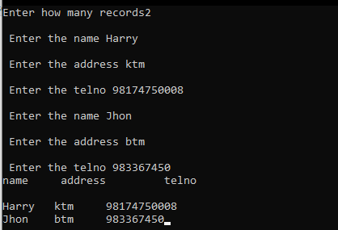

### Create a sample function

> Code

```c
#include <stdio.h>
#include <conio.h>
int main()
{
    printmyname();
    getch();
}
void printmyname()
{
    printf("My name is Saina Pakuwal");
}
```

> Output

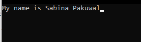

### Print a number by increasing

> Code

```c
#include <stdio.h>
#include <conio.h>
int main()
{
    int a = 8;
    a++;
    printf("The value of a is %d", a);
}
```

> Output

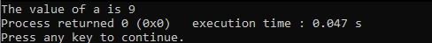

### Wap to enter the name, roll no and mark obtained in computer of n students in a structure and store the details of student in a file named abc.txt having marks obtained in computer more than or equals to 75

> Code

```c
#include <stdio.h>
#include <conio.h>
void main()
{
    int n, i;
    struct student
    {
        char name[20];
        int roll;
        float markcomp;
    } s[100];
    FILE *p;
    printf("input the number of students:");
    scanf("%d", &n);
    p = fopen("abc.txt", "a");
    for (i = 0; i < n; i++)
    {
        printf("input name,rollno and percentage of students:");
        scanf("%s%d%d", s[i].name, &s[i].roll, &s[i].markcomp);
        if (s[i].markcomp >= 75)
        {
            fprintf(p, "%s%d%ld", s[i].name, s[i].roll, s[i].markcomp);
        }
    }
    fclose(p);
    getch();
}
```

> Output

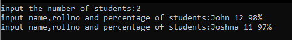

### WAP to show mod

> Code

```c
#include <stdio.h>
#include <conio.h>
int main()
{
    int a = 10;
    int b = 4;
    int c = a % b;
    printf("the mode of c is %d", c);
    return 0;
}
```

> Output

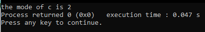

### WAP to print a name and subject

> Code

```c
#include <stdio.h>
#include <conio.h>
void main()
{
    printf("Sabina Pakuwal\n");
    printf("computer science");
    getch();
}
```

> Output

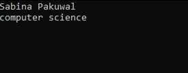

### WAP to ask and print name, address and tel no

> Code

```c
#include <stdio.h>
#include <conio.h>
void main()
{
    char name[25];
    char address[25];
    char tellno[245];
    FILE *fp;
    int i, n;
    fp = fopen("rec.data", "a");
    printf("Enetr how many records");
    scanf("%d", &n);
    for (i = 0; i < n; i++)
        ;
    {
        prinf("Enter name");
        scanf("%s", name);
        printf("Enter address");
        scanf("%s", address);
        printf("Enter tellno");
        scanf("%s", tellno);
        fprintf("\n %s\t %s\t %s", name, address, tellno);
    }
    fclose(fp);
    fp = fopen("rec.data", "r");
    printf("Name\t Address\t Tellno\n");
    while (fscanf(fp, "%s%s%s", name, address, tellno) != EOF)
    {
        printf("\n %s \t%s \t%s", name, address, tellno);
    }
    fclose(fp);
    getch();
}
```

> Output

### WAP to reverse a string

> Code

````c
#include<stdio.h>
#include<conio.h>
void main()
{
char[50],str,rev;
printf("Enter a string);
scanf("%s",str);
rev=strrev(str);
printf("reverse of string is %s",rev);
getch();
}
```

> Output

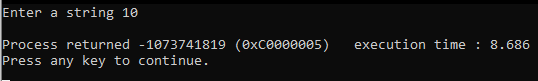

### WAP for simple interest

> Code

```c
#include <stdio.h>
#include <conio.h>
void si(int,int,int);
void main()
{
    int p,t,r;
    printf("Enter principle,time,rate");
    scanf("%d%d%d",&p,&t,&r);
    si(p,t,r);
    getch();
}
void si(int p,int t,int r)
{
    int s;
    s=(p*t*r)/100;
    printf("simple interest is %d",s);

}
````

> Output

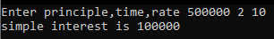

### C program to print fibonacci series upon nth term using function

> Code

```c
#include <stdio.h>
#include <conio.h>
void fibo(int));
void main()
{
    int n;
printf(""enter how many numbers")
scanf("%d"&n);
fibo(n);
getch();
}
void fibo'(intn)
{
    int a = 0, b = 1, c, i;
    for (i = 0; i < n; i++)
    {
        ca + b
                 print("%d", a);
        a = b
            b = c
    }
}
```

> Output

### Area of circle

> Code

```c
#include <stdio.h>
#include <conio.h>
void area(int);
void main()
{
    int r;
    printf("enter radius");
    scanf("%d", &r);
    getch();
}
void area(int r);
int a;
a = r * r;
printf("%d area of circle is", a);
}
```

> Output

### Greatest of two number

> Code

```c
#include <stdio.h>
#include <conio.h>
void G(int,int);
void main()
{
    int a, b;
    printf("Enter any two number");
    scanf("%d%d", &a, &b);
    void G(a,b);
    getch();
}
    void G(int a, int b);
    if (a > b)
    {
print("Greatest is %d", &a);
    }
else{
            printf("Greatest is %d", b);
}
```

> Output

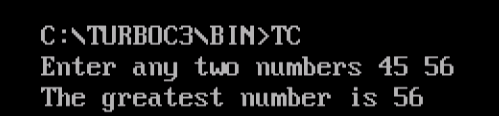

### Program to input and find its factorial using recursion function

> Code

```c
#include <stdio.h>
#include <conio.h>
int factorial(int);
void main()
{
    int n, fact;
    printf("input anumber");
scanf(%d",&n);
fact=factorial(n);
printf("The factorial  of %d is %d,n,fact);
getch();
}
intfactorial(intn)
if (n==0//==1)
return1;
else,
return(n*factorial(n_1));
}
```

> Output

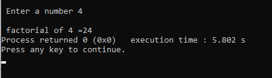

### program toinput employee,name,age and theirbasic salary of n employee and displsy the record in proper format

> Code

```c
#include <stdio.h>
#include<conio.h>
void main()
struct employee;
{
    char name[50];
    int salary;
    int age;
};
struct employee e[100];
int i, n;
printf("how much records");
scanf(% d "&n);
          for (i = 0; i < n; i++);
      {
          fflush(stdin);
printf(;/n enter name of employee");
gets(e[i],name);
printf("/n enter salary of employee");
scanf("%d",&e[i]salary);
printf("/nemployee\t\t salary");
printf("\n.............");
printf("enter the age:");
scanf("%d",&e[i]age);
for(i=0;i<n;i++);
{
        printf("%s\t%d\t%d\t%d\t",e[i].name,e[i].salary,e[i].age);
}
printf(")\n.........);
getch();
      }
```

> Output

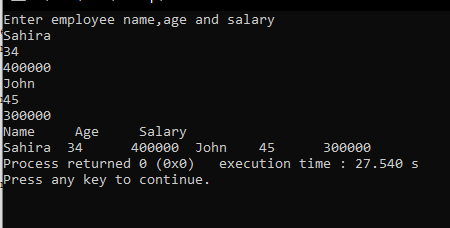

### Program to exchange the value by using function

> Code

```c
#include <stdio.h>
#include <conio.h>
intfncn(int, int);
void main()
{
    int x, y;
    x = 20;
    y = 30;
     printf("\nvalue of x=%d and y=y=%d", x, y);
    fncn(x, y);
printf("\n value of x=%d and y =%d,x,y);
getch();
void fncn(p,q)
{
        int t;
        t = p;
        p = q;
        q = p;
}
}
```

> Output

### Remove and rename

> Code

```c
#include <stdio.h>
#include <conio.h>
void main()
{
    char name[25];
    FILE *fp;
    fp = fopen("f.txt", "w");
    printf("Inut name");
    scanf("%s", name);
    fprintf(fp, "%s", name);
    fclose(fp);
    rename("f.txt", "new.txt");
    remove("f.txt");
    getch();
}
```

> Output

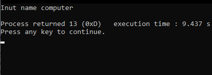

### Program to display the address and value of variable using pointer

> Code

```c
#include <stdio.h>
#include <conio.h>
void main()
{
    int i = 3, *j;
    j = &i;
    clrscr();
    printf("address of i= %u", j);
    printf("value of i=%d", *j);
    getch();
}
```

> Output
> 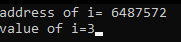

### Area of Square

> Code

```c
#include <stdio.h>
#include <conio.h>
void main()
{
    int l, area;
    printf("Enter length");
    scanf("%d", &l);
    area = l * l;
    {
        printf("area of square is %d");
    }
    getch();
}
```

> Output

### Structure

> Code

```c
#include <stdio.h>
#include <conio.h>
void main()
{
    struct book
    {
        char name[50];
        float price;
        int page;
    };
    struct book b[100];
    float temp;
    int i;
    for (i = 0; i < 100; i++)
        ;
    {
        printf("\n Enter name");
        scanf("%s", b[i].name);
        printf("\n Enter price");
        scanf("\f", &temp);
        b[i].price = temp;
        printf("Enter page");
        scanf("%d", &b[i]);
    }
    for (i = 0; i < 100; i++)
    {
        printf("\n name:%s \t price:%f \t page:%d", b[i].name, b[i].price, b[i].page);
    }
    return 0;
}
```

> Output

### WAP to print the sum of two numbers

> Code

```c
#include <stdio.h>
#include <conio.h>
void main()
{
    int a, b, sum;
    printf("Enter any  two numbers");
    scanf("%d %d", &a, &b);
    sum = a + b;
    {
        printf("sum is %d", sum);
    }
    getch();
}
```

> Output

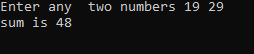

### Sum

> Code

```c
#include <stdio.h>
#include <conio.h>
int main()
{
    int first = 1;
    int second = 40;
    int sum = first + second;
    printf("sum of two no is %d", sum);
    return 0;
}
```

> Output

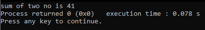

### Wap to print a day of a week using switch case

> Code

```c
#include <stdio.h>
#include <conio.h>
int main()
{
    int number;
    printf("Enter the no\n");
    scanf("%d", &number);
    switch (number)
    {
    case 1:
        printf("The day is Sunday:\n");
        break;
    case 2:
        printf("The day is Monday:\n");
        break;
    case 3:
        printf("The day is Tuesday:\n");
        break;
    case 4:
        printf("The day is Wednesday:\n");
        break;
    case 5:
        printf("The day  is Thursday:\n");
    case 6:
        printf("The day is Friday:\n");
        break;
    Default:
        printf("Invalid option given");
    }
    return 0;
}
```

> Output

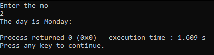

### Telno

> Code

```c
#include <stdio.h>
#include <conio.h>
void main()
{
    int i, a[10];
    for (i = 0; i < 10; i++)
        ;
    {
        printf("Enter the number %d:", i + 1);
        scanf("%d", &a[i]);
    }
    printf("The number you entered are:");
    for (i = 0; i < 10; i++)
    {
        printf("\n%d", a[i]);
    }
    getch();
}
```

> Output

### Adding two numbers using function

> Code

```c
#include<stdio.h>
#include<conio.h>
void (sum);
int main()
{

    sum;
    getch();

}
void main();
{
int a,b,c;
printf("Enter any two numbers");
scanf("%d%d",&a,&b);
c=a+b;
{
printf("Addition is %d",c);
}

    }
```

> Output

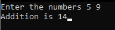
