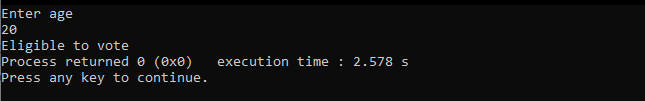

## C Projects of Class 12 by Sabina Pakuwal.

##        Acknowledgement
   I would like to express my special thanks of gratitude to my teacher Mr. Manish Shah 
   for providing a golden opportunity to do this wonderful project which helped me in
   doing a lot of research and I came to know about so many new things.
   
 
##    Introduction
   I am presenting a project assignment on the topic of C-programming project.
   C is a programming language developed at AT and Bell Labroratories of the USA in the 1970s.
   It was designed and developed by Dennis M.Ritchie. It stands between high-level language 
   and low-level language so, it is also known as middle-level language.
   
             
             
 Here are 16 program of c which I have done as my project work.

 ### 1. Write a program to print asterisk

> Code

```c
#include <stdio.h>
void main()
{
    int i, j;
    for (i = i; i <= 1; i++) // rows
    {
        for (j = 1; j <= i; j++) // column

        {
            printf("*");
        }
        printf("\n");
    }
    return 0;
}
```


> Output


### 2. Write a program to store record of 2 books

> Code

```c
#include <stdio.h>
#include <conio.h>
struct book
{
    char name[50];
    float price;
    int pages;
};
void main()
{
    struct book b[100]; /*array of students */
    float temp;
    int i;
    for (i = 0; i < 2; i++)
        ;
    {
        printf("\n Enter name:");
        scanf("%s", b[i].name);
        printf("\n Enter price:");
        scanf("%f", &temp);
        b[i].price = temp;
        printf("\n Enter pages:");
    }
    for (i = 0; i < 2; i++)
    {
        printf("\nName:%s \t pice:%f \t  pages:%d", b[i].name, b[i].price, b[i].pages);
    }
    getch();
}
```

> Output


### 3. Write a program to find whether a person is eligible to vote or not

> Code

```c
#include <stdio.h>
#include <conio.h>
int main()
{
    int age;
    printf("Enter age\n");
    scanf("%d", &age);
    if (age >= 18)
    {
        printf("Eligible to vote");
    }
    else
    {
        printf("Not eligible to vote");
    }
    return 0;
}
```

> Output



### 4. Write a program to print numbers upto 50
> Code

```c
#include <stdio.h>
#include <conio.h>
int main()
{
    int a;
    while (a <= 50)
    {
        printf("%d\n", a);
        a++;
    }
    getch();
}
```

> Output


### 5. Write a program to write 'n' person name, address and tel no in a data file and display them reading successive data from the file in proper format

> Code

```c
#include <stdio.h>
#include <conio.h>
void main()
{
    char name[25];
    char address[25];
    char telno[25];
    FILE *fp;
    int i, n;
    fp = fopen("rec.data", "a");
    scanf("%d", &n);
    for (i = 0; i < n; i++)
    {
        printf("\n Enter the name");
        scanf("%s", name);
        printf("\n Enter the address");
        scanf("%s", address);
        printf("\n Enter the telno");
        scanf("%s", telno);
        fprintf(fp, "\n%s\t%s\t%s", name, address, telno);
    }
    fclose(fp);
    fp = fopen("rec.data", "r");
    printf("name\t address \t telno\n");
    while (fscanf(fp, "%s%s%s", name, address, telno) != EOF)
    {
        printf("\n%s \t%s \t%s", name, address, telno);
    }
    fclose(fp);
    getch();
}
```

> Output


### 6. Write a program to Print a number by increasing 1

> Code

```c
#include <stdio.h>
#include <conio.h>
int main()
{
    int a = 8;
    a++;
    printf("The value of a is %d", a);
}
```

> Output


### 7. Write a program  to show mod 

> Code

```c
#include <stdio.h>
#include <conio.h>
int main()
{
    int a = 10;
    int b = 4;
    int c = a % b;
    printf("the mode of c is %d", c);
    return 0;
}
```

> Output


### 8. Write a program to find simple interest

> Code

```c
#include <stdio.h>
#include <conio.h>
void si(int,int,int);
void main()
{
    int p,t,r;
    printf("Enter principle,time,rate");
    scanf("%d%d%d",&p,&t,&r);
    si(p,t,r);
    getch();
}
void si(int p,int t,int r)
{
    int s;
    s=(p*t*r)/100;
    printf("simple interest is %d",s);

}
```

> Output


### 9. Write a program to find the greatest of two numbers

> Code

```c
#include <stdio.h>
#include <conio.h>
void G(int,int);
void main()
{
    int a, b;
    printf("Enter any two number");
    scanf("%d%d", &a, &b);
    void G(a,b);
    getch();
}
    void G(int a, int b);
    if (a > b)
    {
print("Greatest is %d", &a);
    }
else{
            printf("Greatest is %d", b);
}
```

> Output


### 10.Wap to input a number and find its factorial using recursion function

> Code

```c
#include <stdio.h>
#include <conio.h>
int factorial(int);
void main()
{
    int n, fact;
    printf("input anumber");
scanf(%d",&n);
fact=factorial(n);
printf("The factorial  of %d is %d,n,fact);
getch();
}
intfactorial(intn)
if (n==0//==1)
return1;
else,
return(n*factorial(n_1));
}
```

> Output


### 11. Wap to input employee,name,age and their basic salary and displsy the record in proper formate

> Code

```c
#include <stdio.h>
#include<conio.h>
void main()
struct employee;
{
    char name[50];
    int salary;
    int age;
};
struct employee e[100];
int i, n;
printf("how much records");
scanf(% d "&n);
          for (i = 0; i < n; i++);
      {
          fflush(stdin);
printf(;/n enter name of employee");
gets(e[i],name);
printf("/n enter salary of employee");
scanf("%d",&e[i]salary);
printf("/nemployee\t\t salary");
printf("\n.............");
printf("enter the age:");
scanf("%d",&e[i]age);
for(i=0;i<n;i++);
{
        printf("%s\t%d\t%d\t%d\t",e[i].name,e[i].salary,e[i].age);
}
printf(")\n.........);
getch();
      }
```

> Output


### 12. Write a program to display the address and value of variable using pointer

> Code

```c
#include <stdio.h>
#include <conio.h>
void main()
{
    int i = 3, *j;
    j = &i;
    clrscr();
    printf("address of i= %u", j);
    printf("value of i=%d", *j);
    getch();
}
```

> Output


### 13. Write a program to find area of Square

> Code

```c
#include <stdio.h>
#include <conio.h>
void main()
{
    int l, area;
    printf("Enter length");
    scanf("%d", &l);
    area = l * l;
    {
        printf("area of square is %d" area);
    }
    getch();
}
```

> Output


### 14. Write a program to print the sum of two numbers

> Code

```c
#include <stdio.h>
#include <conio.h>
void main()
{
    int a, b, sum;
    printf("Enter any  two numbers");
    scanf("%d %d", &a, &b);
    sum = a + b;
    {
        printf("sum is %d", sum);
    }
    getch();
}
```

> Output


### 15. Write a program to print a day of a week using switch case

> Code

```c
#include <stdio.h>
#include <conio.h>
int main()
{
    int number;
    printf("Enter the no\n");
    scanf("%d", &number);
    switch (number)
    {
    case 1:
        printf("The day is Sunday:\n");
        break;
    case 2:
        printf("The day is Monday:\n");
        break;
    case 3:
        printf("The day is Tuesday:\n");
        break;
    case 4:
        printf("The day is Wednesday:\n");
        break;
    case 5:
        printf("The day  is Thursday:\n");
    case 6:
        printf("The day is Friday:\n");
        break;
    Default:
        printf("Invalid option given");
    }
    return 0;
}
```

> Output


### 16. Write a program to add two numbers using function

> Code

```c
#include<stdio.h>
#include<conio.h>
void (sum);
int main()
{

    sum;
    getch();

}
void main();
{
int a,b,c;
printf("Enter any two numbers");
scanf("%d%d",&a,&b);
c=a+b;
{
printf("Addition is %d",c); 
}..

    }
```

> Output


   ## Conclusion
     So, this is the work that I have done and I am very thankful to the subject teacher and
     at the end of this project it has enhance my knowledge and it will really help me in my
     upcomming exams. I have done this project with the help of notecopy, book and subject teacher. 
               
                                                                                  Your's sincerely
                                                                                  Sabina Pakuwal
                               
